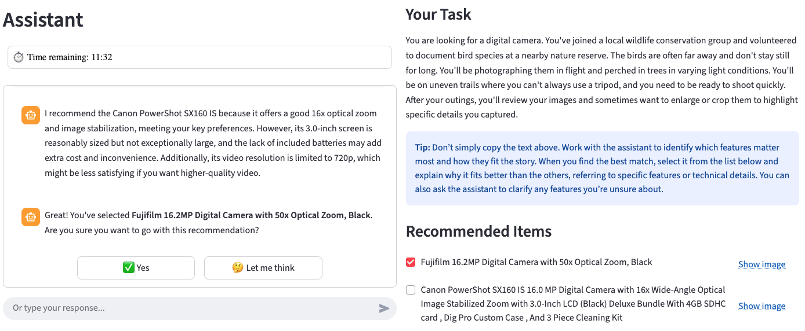

# RecQuest: Towards Estimating User Domain Knowledge in Conversational Recommender Systems

This repository provides resources developed for the accompanying article [[PDF]](https://dl.acm.org/doi/epdf/10.1145/3805713.3820438).

## Summary

The ideal conversational recommender system (CRS) acts like a savvy salesperson, adapting its language and suggestions to a user's expertise. Most current systems, however, treat all users as experts, leading to frustrating and inefficient interactions when users are unfamiliar with a domain. To enable such adaptation, a CRS must first estimate a user's domain knowledge from interaction signals. Yet accurately estimating knowledge typically requires tailored interactions that elicit those signals in the first place, creating a fundamental chicken-and-egg problem.

We take a first step toward breaking this dependency with **RecQuest**, a game-with-a-purpose data collection protocol designed to elicit varied expressions of domain knowledge while using a target-aware CRS to guide interactions. Such a protocol is necessary because existing dialogue collections allow users to express their own preferences, which tends to focus conversations on popular items and familiar features and provides little evidence of how novices explore or learn about unfamiliar features. Using the resulting multi-domain dataset, we introduce the task of estimating user domain knowledge directly from conversational transcripts and provide baseline methods and analyses to support future work on user-knowledge-aware conversational recommender systems.

## RecQuest

**RecQuest** is a recommendation-game used for data collection; participants interacted with a guided search-and-recommendation task (example interaction below).



## Dataset

The dataset and supporting materials are available in the `data/` folder; see [`data/README.md`](data/README.md) for an overview and file locations.

Descriptive statistics: number of dialogues (#Dial) and utterances (#Utt) are total counts, while values for the number of turns (#Turns), preferences (#Prefs), and recommendations (#Recs) are reported as mean ± standard deviation. Success rate (Success) is the proportion of dialogues where participants found the target item.

| Domain         | #Dial | #Utt | #Turns (mean ± SD) | #Prefs (mean ± SD) | #Recs (mean ± SD) | Success |
|----------------|-------|------|--------------------|--------------------|-------------------|----------|
| Bicycle        | 79    | 1521 | 9.53 ± 4.71        | 10.00 ± 4.83       | 3.19 ± 1.35       | 67.9%    |
| Digital Camera | 79    | 1687 | 10.35 ± 4.42       | 10.76 ± 5.23       | 3.42 ± 1.72       | 29.1%    |
| Laptop         | 98    | 2179 | 10.00 ± 4.86       | 10.47 ± 4.51       | 3.60 ± 1.27       | 29.6%    |
| Running Shoes  | 179   | 3636 | 10.07 ± 5.37       | 9.90 ± 5.54        | 3.52 ± 1.43       | 37.1%    |
| Smartwatch     | 80    | 1665 | 10.18 ± 3.63       | 9.61 ± 4.08        | 3.45 ± 1.19       | 37.5%    |
| **Total**      | **515** | **10688** | **10.21 ± 4.81** | **10.10 ± 5.03** | **3.46 ± 1.41** | **39.3%** |

## Conversational Recommender System (CRS)

The `crs/` directory contains a modular conversational recommender system built with LangChain and Streamlit. See [`crs/README.md`](crs/README.md) for detailed architecture and setup instructions.

### Quick Start

1. Install dependencies:
   ```bash
   pip install -r requirements.txt
   ```

2. Set environment variables:
   ```bash
   export OPENAI_API_KEY="your-api-key"
   ```

3. Run the application:
   ```bash
   streamlit run crs/main.py
   ```

### Supported LLM Providers

- **OpenAI** (default: gpt-4.1-mini)
- **Google**
- **Ollama** (local deployment)


## Citation

If you use the resources presented in this repository, please cite:

```
@inproceedings{10.1145/3805713.3820438,
author = {Kostric, Ivica and Gadiraju, Ujwal and Balog, Krisztian},
title = {RecQuest: Towards Estimating User Domain Knowledge in Conversational Recommender Systems},
year = {2026},
isbn = {9798400726002},
pages = {176–186},
numpages = {11},
series = {ICTIR '26}
} 
```

## Contact

Should you have any questions, please contact Ivica Kostric at ivica.kostric[AT]uis.no (with [AT] replaced by @).
